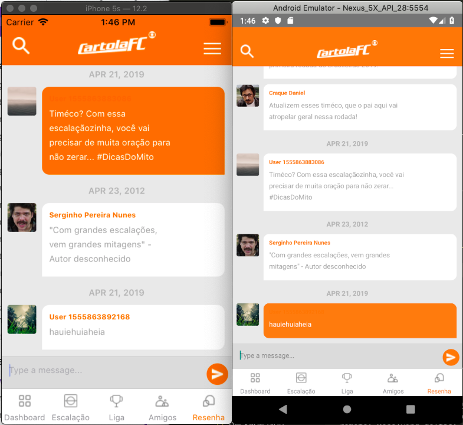

# app

O projeto visa utilizar de melhor maneira os dados gerados pelo CartolaFC

Segue abaixo o modelo de arquitetura:

O aplicativo foi construindo utilizando a tecnologia [React Native](https://facebook.github.io/react-native/).

Para a implementação foram utilizadas as seguintes bibliotecas:
- Chat: [Gifted Chat](https://github.com/FaridSafi/react-native-gifted-chat)
- Navegação: [React Navigation](https://reactnavigation.org)
